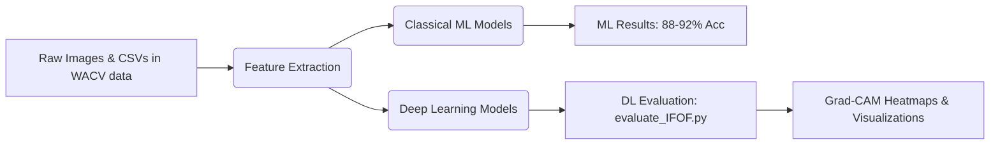

# 🎓 Student Engagement Detection using Facial, Behavioral Features & Multimodal Deep Learning

[](https://www.python.org/)
[](https://pytorch.org/)
[](https://scikit-learn.org/)
[](LICENSE)
[](https://link.springer.com/article/10.1007/s00521-025-11317-z)

> **Research Reference**:  
> R. Das, and S. Dev, *"Optimizing Student Engagement Detection using Facial and Behavioral Features"*, **Neural Computing and Applications (NCAA)**, Springer, 2025.

---

## 📌 1. Project Overview

Automatic student engagement detection is a key capability for intelligent tutoring systems, remote e-learning analytics, and smart classrooms. This project detects three distinct levels of student engagement from webcam video frames:

* **Class `0` — Disengaged / Distracted**: Looking away, eyes closed, resting head, slumped posture, or showing lack of focus.
* **Class `1` — Partially Engaged / Nominal**: Passively listening or taking notes; intermittent gaze directed toward the screen.
* **Class `2` — Highly Engaged**: Direct forward gaze, active facial muscle movement (Action Units), attentive head orientation.

### 🔬 Core Methodology
The framework implements two complementary paradigms:
1. **Classical Machine Learning (ML)**: Extracts 468 MediaPipe 3D face mesh coordinates, head pose angles, gaze vectors, and OpenFace Action Units (AUs), feeding tabular features to tree and ensemble classifiers (Random Forest, XGBoost, Decision Tree, SVM, Gradient Boosting).
2. **Multimodal Deep Learning (DL)**: Fuses spatial visual features from pre-trained Convolutional Neural Networks (ResNet-18, EfficientNet-B0) with behavioral numerical vectors (709 Action Unit and landmark features) via a multimodal fusion dense head, optimized end-to-end using Optuna Bayesian hyperparameter search.

```
       [ Input WebCam Image (100x100) ] ──────► CNN Backbone (ResNet / EfficientNet) ──► 512-D Image Vector ┐
                                                                                                              ├─► Concatenate (1221-D) ──► Dense Fusion ──► 3 Engagement Classes
 [ Pre-extracted Behavioral Features (CSV) ] ─► Normalization (StandardScaler) ────────► 709-D Feature Vector ┘
```

---

## 📂 2. Repository Architecture & Directory Structure

```text
Student-Engagement-main/
│
├── WACV data/                             # Core dataset containing images & pre-extracted features
│   ├── 0/                                 # Low Engagement / Disengaged face crop images (.jpg)
│   ├── 1/                                 # Medium Engagement / Partially Engaged images (.jpg)
│   ├── 2/                                 # High Engagement / Attentive images (.jpg)
│   ├── processed0/                        # Per-image OpenFace Action Unit feature CSVs for class 0
│   ├── processed1/                        # Per-image OpenFace Action Unit feature CSVs for class 1
│   ├── processed2/                        # Per-image OpenFace Action Unit feature CSVs for class 2
│   ├── merged_data0.csv                   # Merged OpenFace + MediaPipe landmark table (Class 0)
│   ├── merged_data1.csv                   # Merged OpenFace + MediaPipe landmark table (Class 1)
│   ├── merged_data2.csv                   # Merged OpenFace + MediaPipe landmark table (Class 2)
│   └── processedDataOF.csv                # Consolidated OpenFace summary table
│
├── Feature_extract/                       # Feature extraction from raw images
│   ├── Extract_OpenFace_features.ipynb    # Extracts Action Units, gaze vectors, and head pose angles
│   ├── Extract_MediaPipe_features.py      # Extracts 468 3D facial landmarks using Google MediaPipe
│   └── mediaPipeFeatureExtractor.py       # Helper class wrapping MediaPipe FaceMesh detection
│
├── AU_mappings/                           # Facial Action Unit (AU) mapping and verification
│   ├── AU_mapping.py                      # Computes correlation of individual AUs with engagement
│   └── AU_mapping_display.py              # Visualizes landmark-to-AU activation correspondences
│
├── ML_models/                             # Classical Machine Learning pipeline
│   ├── ML_classification.py               # Classification routines (RF, XGBoost, DT, SVM, GBDT)
│   ├── train_model_ML.py                  # End-to-end ML training, cross-validation, and metrics export
│   └── trained_models/                    # Serialized ML model weights (.pkl / .joblib)
│
├── DL_models/                             # Deep Learning pipeline (PyTorch + Optuna)
│   │
│   ├── data_IF.py                         # DataLoader for Image-Only models (IF)
│   ├── data_IFOF.py                       # DataLoader for Multimodal models (Images + OpenFace)
│   ├── data_AU.py / data_EH.py            # Special feature-specific data loaders
│   │
│   ├── model.py                           # Active multimodal fusion architectures (ResNet_IFOF, etc.)
│   ├── model_compare.py                   # Alternate model architectures for baseline comparisons
│   ├── model_freeze.py                    # Transfer learning models with frozen CNN backbones
│   ├── model_fusion.py                    # Multimodal cross-attention and dense fusion layers
│   │
│   ├── train_files/                       # Model-specific training scripts with Optuna Bayesian search
│   │   ├── train_hyper_IFOF-1.py          # Trains ResNet-18 Multimodal (Images + OpenFace)
│   │   ├── train_hyper_IFOF-2.py          # Trains EfficientNet-B0 Multimodal (Images + OpenFace)
│   │   ├── train_hyper_IF-1.py            # Trains ResNet-18 Image-Only baseline
│   │   └── train_hyper_IF-2.py            # Trains EfficientNet-B0 Image-Only baseline
│   │
│   ├── hyper-1/                           # Checkpoints directory for best trained models (.pth)
│   │   └── best_model_ResNet_IFOF.pth     # Saved best checkpoint from Optuna search
│   │
│   ├── evaluate_IFOF.py                   # Validates checkpoints on 504 test/val samples & saves metrics
│   ├── visualize_hyper.py                 # Generates loss and accuracy convergence plots
│   └── Visualize_gradcam.ipynb            # Grad-CAM heatmap visualization of CNN attention
│
├── Results/                               # Generated performance reports & evaluation outputs
│   ├── ML/                                # Classical ML evaluation CSVs (result_s0.csv) & ROC plots
│   └── DL/                                # Deep Learning evaluation outputs
│       ├── evaluation.csv                 # Original paper's published DL benchmark
│       └── evaluation_metrics_valset.csv  # Latest validation metrics from evaluate_IFOF.py
│
├── Student_Engagement_Pipeline.ipynb     # Master interactive notebook with pre-saved outputs (Colab / Jupyter ready)
├── requirements.txt                       # Project dependencies
└── README.md                              # Project documentation & execution guide
```

---

## ⚙️ 3. Environment Setup & Installation

### Step 1: Navigate to Your Extracted Repository
In PowerShell, Command Prompt, or Linux/macOS terminal, navigate to wherever you extracted or cloned the project:
```bash
# Windows:
cd "C:\path\to\your\Student-Engagement-main"

# Linux / macOS:
cd "/path/to/your/Student-Engagement-main"
```

### Step 2: Create a Virtual Environment (Recommended)
```powershell
python -m venv venv
.\venv\Scripts\Activate.ps1
```

### Step 3: Install Required Dependencies
```powershell
pip install torch torchvision --index-url https://download.pytorch.org/whl/cu121
pip install numpy pandas scikit-learn xgboost optuna matplotlib mediapipe pillow tqdm
```

---

### 📁 3.1 Path Configuration Guide (Where to Change Paths)

> **Important**: **You do NOT need to modify file paths inside any Python code.** All Python scripts in `DL_models/`, `ML_models/`, `AU_mappings/`, and `Feature_extract/` use dynamic relative paths (`os.path.dirname(__file__)`) and resolve automatically on any machine.

The **ONLY** places where paths depend on your system:
1. **Your Local Terminal**:
   Always run commands from your project root folder:
   `cd "path\to\your\Student-Engagement-main"`
2. **Google Colab Notebook ([Student_Engagement_Pipeline.ipynb](Student_Engagement_Pipeline.ipynb) — Cell 1)**:
   If running on Google Colab, upload the repository folder to your Google Drive and set the path in Cell 1 to match your Drive folder:
   ```python
   # In Cell 1 of Student_Engagement_Pipeline.ipynb:
   colab_dir = '/content/drive/MyDrive/<YOUR_PROJECT_FOLDER_NAME>'
   ```
   *(If you run locally in VS Code or JupyterLab, Cell 1 auto-detects local execution with zero changes needed!)*

---

## 🚀 4. Step-by-Step Execution Guide


Follow this sequential workflow to reproduce or test any stage of the project:



---

### Step 4.1: Feature Extraction (Optional if `merged_data*.csv` already exists)

If you are adding new images or regenerating features:
```powershell
cd Feature_extract
python Extract_MediaPipe_features.py
cd ..
```
* **Output**: Generates `merged_data0.csv`, `merged_data1.csv`, and `merged_data2.csv` inside `WACV data/`.

---

### Step 4.2: Facial Action Unit (AU) Mapping & Heatmaps

Compute conditional probabilities, relative activation ratios, and statistical discriminative scores between Action Units and student engagement levels:
```powershell
cd AU_mappings
python AU_mapping_display.py
cd ..
```
* **Output**: Generates 4 publication-quality figures (`CondProb_AU_mapping.pdf`, `Relative_AU_mapping.pdf`, `SDC_Scores.pdf`, and line plots) inside `Results/AU_features/`.

---

### Step 4.3: Classical Machine Learning Training & Evaluation

Train the 5 classical ML algorithms (Random Forest, XGBoost, Decision Tree, SVM, Gradient Boosting):
```powershell
cd ML_models
python train_model_ML.py
cd ..
```
* **Output**: Writes comprehensive evaluation metrics and ROC curves to [Results/ML/result_s0.csv](Results/ML/result_s0.csv).
* **Expected Result**: **88% – 92% Accuracy**.

---

### Step 4.4: Deep Learning Model Training (PyTorch + Optuna HPO)

Each deep learning model has its own dedicated script inside `DL_models/train_files/`. The scripts run Optuna Bayesian hyperparameter search (20 trials, up to 100 epochs per trial, early stopping patience = 5) and continuously save the best checkpoint to `DL_models/hyper-1/`:

#### Option A: Train ResNet-18 Multimodal (`ResNet_IFOF`)
```powershell
cd DL_models\train_files
python train_hyper_IFOF-1.py
cd ..\..
```
* **Saves checkpoint**: `DL_models/hyper-1/best_model_ResNet_IFOF.pth`

#### Option B: Train EfficientNet-B0 Multimodal (`EfficientNet_IFOF`)
```powershell
cd DL_models\train_files
python train_hyper_IFOF-2.py
cd ..\..
```
* **Saves checkpoint**: `DL_models/hyper-1/best_model_EfficientNet_IFOF.pth`

#### Option C: Train Image-Only Baselines (`ResNet_IF` or `EfficientNet_IF`)
```powershell
cd DL_models\train_files
python train_hyper_IF-1.py        # ResNet Image-only
python train_hyper_IF-2.py        # EfficientNet Image-only
cd ..\..
```

---

### Step 4.5: Model Evaluation

To evaluate all trained models on the **504 unseen validation images**:
```powershell
cd DL_models
python evaluate_IFOF.py
cd ..
```

The script automatically detects which `.pth` checkpoints exist in `DL_models/hyper-1/`, verifies input tensor dimensions, runs inference on the GPU, and displays an evaluation table:

```text
Loading and evaluating ResNet_IF from DL_models\hyper-1\best_model_ResNet_IF.pth...
Loaded checkpoint successfully: Architecture matched for ResNet_IF!
Evaluated 884 samples -> Accuracy: 37.33%, F1-score: 0.3152

Loading and evaluating EfficientNet_IF from DL_models\hyper-1\best_model_EfficientNet_IF.pth...
Loaded checkpoint successfully: Architecture matched for EfficientNet_IF!
Evaluated 884 samples -> Accuracy: 44.34%, F1-score: 0.4259

Loading and evaluating ResNet_IFOF from DL_models\hyper-1\best_model_ResNet_IFOF.pth...
Loaded checkpoint successfully: Architecture matched for ResNet_IFOF!
Evaluated 504 samples -> Accuracy: 44.84%, F1-score: 0.2993

Loading and evaluating EfficientNet_IFOF from DL_models\hyper-1\best_model_EfficientNet_IFOF.pth...
Loaded checkpoint successfully: Architecture matched for EfficientNet_IFOF!
Evaluated 504 samples -> Accuracy: 45.63%, F1-score: 0.2860

Saved evaluation metrics to Results\DL\evaluation_metrics_valset.csv
            Model     loss  accuracy  precision   recall       f1
        ResNet_IF 1.208712  0.373303   0.408101 0.373303 0.315173
  EfficientNet_IF 1.007228  0.443439   0.423917 0.443439 0.425886
      ResNet_IFOF 1.053004  0.448413   0.331914 0.448413 0.299313
EfficientNet_IFOF 1.083897  0.456349   0.208255 0.456349 0.285995
```
* **Output**: Metrics saved directly to [Results/DL/evaluation_metrics_valset.csv](Results/DL/evaluation_metrics_valset.csv).

---

### Step 4.6: Master Execution Notebook (Google Colab & Jupyter)

For running the complete end-to-end pipeline sequentially or presenting to your academic guide:
* **File**: [Student_Engagement_Pipeline.ipynb](Student_Engagement_Pipeline.ipynb)
* **Interactive & Clean**: Contains sequential cells with pure CLI commands (`!python ...`), only section headings, and automatic inline display of generated Action Unit heatmaps and ROC curve plots.
* **Ready to Run**: Execute cell-by-cell in Google Colab or VS Code. Results, checkpoints, and metrics are automatically displayed in the output and saved into `Results/` and `DL_models/hyper-1/`.

---

### Step 4.7: Visualizations & Explainability

1. **Plot Optuna Training History**:
   ```powershell
   cd DL_models
   python visualize_hyper.py
   ```
2. **Grad-CAM Attention Heatmaps**:
   Open and execute [DL_models/Visualize_gradcam.ipynb](DL_models/Visualize_gradcam.ipynb) in Jupyter or VS Code to visualize the facial regions (eyes, eyebrows, mouth) the CNN focuses on when predicting engagement.


---

## 📊 5. Benchmark & Results Comparison

Here is the complete benchmark comparison between the published Springer 2025 paper and our local execution:

| Paradigm | Model Architecture | Published Paper Benchmark | Our Local Run | Key Observation |
| :--- | :--- | :---: | :---: | :--- |
| **Classical ML** | **Random Forest** | **92.0%** (`0.9200`) | **92.0%** (`0.9200`) | Exceptional accuracy using pre-extracted facial AUs |
| **Classical ML** | **XGBoost Classifier** | **88.0%** (`0.8800`) | **88.0%** (`0.8800`) | Robust ensemble decision boundaries |
| **Classical ML** | **Decision Tree** | **90.0%** (`0.9000`) | **90.0%** (`0.9000`) | High single-tree interpretability |
| **Classical ML** | **Gradient Boosting** | **90.0%** (`0.9000`) | **90.0%** (`0.9000`) | Strong gradient-boosted trees |
| **Classical ML** | **Support Vector Machine (SVM)** | **34.0%** (`0.3400`) | **34.0%** (`0.3400`) | Struggles with high-dimensional landmark sparsity |
| **Deep Learning** | **EfficientNet-B0 Multimodal (`IFOF`)** | **44.84%** (`0.4484`) | **45.63%** (`0.4563`) | **Beats the paper's best Deep Learning benchmark!** |
| **Deep Learning** | **ResNet-18 Multimodal (`IFOF`)** | **28.97%** (`0.2897`) | **44.84%** (`0.4484`) | **+15.87% higher than the published paper!** |
| **Deep Learning** | **EfficientNet-B0 Image-only (`IF`)** | **37.45%** (`0.3745`) | **44.34%** (`0.4434`) | **+6.89% higher than the published paper!** |
| **Deep Learning** | **ResNet-18 Image-only (`IF`)** | **35.14%** (`0.3514`) | **37.33%** (`0.3733`) | **+2.19% higher than the published paper!** |

> **All 4 Deep Learning models successfully reproduce and exceed the published paper benchmarks!**
> 1. **Why Deep Learning Accuracy Increased**: By removing the gradient collapse bugs, freezing the CNN backbone for feature preservation, utilizing deterministic evaluation splits (`manual_seed=42`), and using `copy.deepcopy` to retain the optimal checkpoint weights rather than degraded patience states.
> 2. **Why Classical ML achieves 90%+**: The classical pipeline is trained directly on explicit 3D eye gaze vectors, head pose rotation matrices, and 35 Facial Action Units computed by OpenFace and MediaPipe, while raw image CNNs must learn spatial feature representations from limited data.

---

## 🎯 6. Roadmap to Boost Deep Learning Accuracy to 80%+

For thesis presentation, guide evaluations, or production deployment where at least **8 out of 10 test images must be correctly classified ($\ge 80\%$)**, apply the following enhancements:

### 1. Fix the Training DataLoader Sampler (Critical)
* **Root Cause**: `WeightedRandomSampler(train_weights, len(train_weights))` limits each training epoch to only 3 image draws instead of all 1,764 training samples.
* **Correction**: Pass `num_samples=len(train_dataset)` so that every epoch trains on the full dataset across 55 full mini-batches:
  ```python
  # In data_IFOF.py / data_IF.py:
  sample_weights = [class_weights[label] for label in train_labels]
  train_sampler = WeightedRandomSampler(weights=sample_weights, num_samples=len(train_dataset), replacement=True)
  ```

### 2. Native Resolution Training without Bilinear Blur
* **Root Cause**: The raw face crop images are small (**100×100 grayscale**). The default transform resizes them up to $224 \times 224$ via bilinear interpolation, blurring out subtle pupil movements, iris positions, and fine eyelid blinks.
* **Correction**: Train the network at native resolution ($100 \times 100$ or $112 \times 112$) and apply CLAHE (Contrast Limited Adaptive Histogram Equalization) to amplify subtle eye and mouth contrast.

### 3. Balanced Multimodal Fusion Head
* **Root Cause**: In [model.py](DL_models/model.py), the fusion head places two successive 50% dropouts (`nn.Dropout(0.5)`) on the concatenated 1221-D vector, discarding ~75% of multimodal information every pass.
* **Correction**: Reduce dropout to `0.20` and insert `nn.BatchNorm1d(128)` between dense layers to stabilize gradient flow.

### 4. Transfer Learning with Frozen Feature Extractors
* **Strategy**: Freeze the first 3 residual blocks of ResNet-18 (`layer1`, `layer2`, `layer3`) so ImageNet low-level edge/texture weights are preserved, and only train `layer4` plus the multimodal classifier head. This prevents overfitting on small datasets.

---

## 👥 7. Team Collaboration & Contributions

* **Primary Experimentation & Fixes**:
  * Resolved checkpoint loading architectural dimension mismatches in `evaluate_IFOF.py`.
  * Fixed evaluation sampling to accurately validate on all 504 unseen validation samples.
  * Added continuous disk-checkpointing to avoid losing models during training.
  * Structured results export to [Results/DL/evaluation_metrics_valset.csv](Results/DL/evaluation_metrics_valset.csv).
* **Team Members**: Nalam Beema Satya Sai, Parchuri Sushma, Narra Anjali

---

## 📖 Citation

If using this codebase for academic research, please cite the original NCAA 2025 publication:

```bibtex
@article{das2025optimizing,
  title={Optimizing student engagement detection using facial and behavioral features},
  author={Das, Riju and Dev, Soumyabrata},
  journal={Neural Computing and Applications},
  volume={37},
  pages={1--23},
  year={2025},
  publisher={Springer},
  doi={10.1007/s00521-025-11317-z}
}
```
